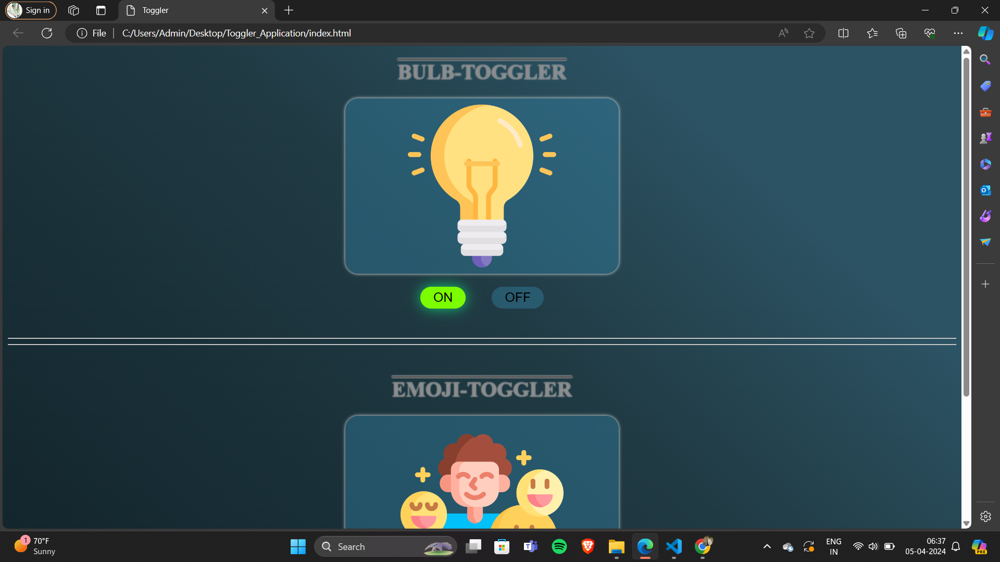
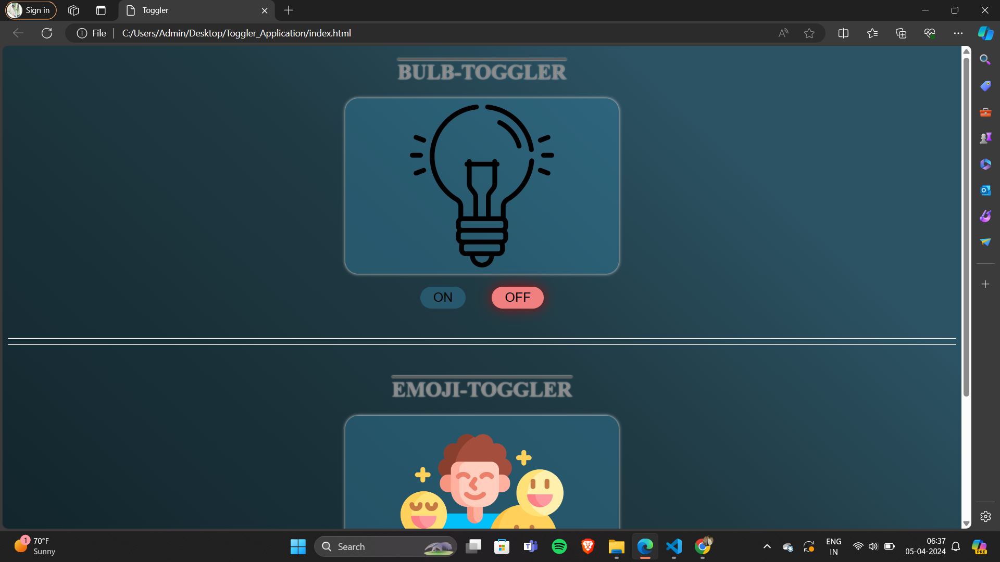

# TOGGLER-APPLICATION

**WELCOME TO TOGGLER-APPLICATION DESIGN:**
This is a `open-source` project serves as an example for Toggler design inspired from the Toggler applications` TOGGLER-APPLICATION
` design and utilised the knowledge provided by `road to code's
course`.

whether you are an employee or a normal person this Appplication can help you to have a basic idea about how a Toggler is designed and how it  works.This `Toggler` is based on the design of `Bulb-Toggler` & `Emoji-Toggler`.

`BULB-ON`

`BULB-OFF`

## How to contribute 

We welcome contributions from the community to help us improve this project.IF you would like to contribute,follow these steps:

1.Fork the repository to your Github account 

2.Make your changes, add new content,or fix any existing issues.

3.Open a new pull request in this repository.

